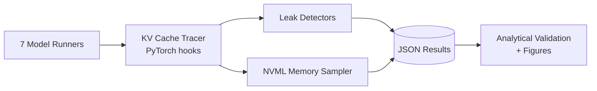

# KVScope: Cross-Architecture KV Cache Profiling

Profiling KV cache dynamics across MHA, GQA, sliding-window, MoE, and SSM architectures.

---

## Motivation

KV cache is the dominant memory bottleneck during LLM inference: a 256K-context request on Gemma 4 31B consumes ~15.7 GB of KV cache alone. The seven models profiled here each solve this problem with a fundamentally different architectural approach. KVScope instruments all of them through the same tracing framework to compare how KV cache actually grows during generation, whether unreleased cache accumulates after sequence completion, and which mitigations are effective per architecture.

| Model | KV Cache Strategy | Key Innovation |
|---|---|---|
| Pythia-1.4B | Pure MHA (architectural anchor) | Baseline: num_kv_heads == num_attention_heads; no compression |
| Gemma 4 | GQA + Shared KV + Local/Global interleave | K==V in global layers halves cache; shared KV across layers eliminates redundant projections |
| GLM-4.7-Flash | MoE + DeepSeek Sparse Attention (DSA) | Expert routing makes KV usage non-deterministic per token; sparse attention reduces compute |
| gpt-oss-120B | GQA + Sliding/Full hybrid + MoE FFN | Alternating sliding and full-attention layers; extreme bimodality (CV=0.935) |
| Nemotron | Mamba SSM + Sparse GQA attention | Hybrid state-space + attention; selective quantization for efficiency |
| LFM2.5-350M | LIV convolution + GQA hybrid | 10 LIV convolution blocks + 6 GQA blocks; departure from pure Transformer architecture |
| DeepSeek V4 | CSA/HCA hybrid (Compressed Sparse/Heavily Compressed Attention) | 4x/128x sequence compression; 2% KV cache vs traditional GQA; 1M context window |

---

## Architecture



---

## Components

### `src/profiler/kv_tracer.py`
Forward hooks on attention layers that capture K and V tensor shapes, sizes, dtypes, and GPU memory at each decode step. Hook strategy varies by model: GQA layout for Gemma 4 and gpt-oss, plain DynamicCache for GLM, MLA latent extraction for DeepSeek. Supports both legacy and modern HF cache formats.

### `src/profiler/leak_detector.py`
Four detectors that run on the captured snapshot data. Growth curve: linear regression on KV size vs step, flagging super-linear accumulation. Post-EOS: NVML memory before and after generation, detecting unreleased blocks. Fragmentation: gap between `reserved` and `allocated` GPU memory. Layer anomaly: Z-score outlier detection on per-layer cache sizes at final step.

### `src/profiler/triton_ops.py`
GPU kernels for per-head L2 norm computation, MLA Frobenius compression ratio, and attention entropy. Each kernel has a pure-PyTorch fallback.

### `src/mitigations/mitigations.py`
Three inference-time strategies benchmarked against baseline: KV quantization (INT8/FP8), H2O heavy-hitter token eviction, and prefix KV sharing via RadixAttention.

---

## Model Coverage Status

| Model            | H100 V1    | H200 V2    | Status                    |
|------------------|------------|------------|---------------------------|
| Pythia-1.4B      | Profiled   | Profiled   | Baseline (MHA anchor)     |
| Gemma 4          | Profiled   | Profiled   | Production ready          |
| GLM-4.7-Flash    | Profiled   | Failed     | Float8 conversion blocker |
| gpt-oss          | Profiled   | Profiled   | Production ready          |
| Nemotron-H       | -          | Control    | SSM, use_cache=False      |
| Qwen 3.6         | -          | Profiled   | Added in V2               |
| LFM2.5-350M      | Failed     | Failed     | CUDA kernel blocker       |
| DeepSeek V4      | Planned    | Planned    | Not yet attempted         |

---

## Results Summary

### H100 V1 Run (2026-04-27)
*NVIDIA H100 80GB HBM3 (driver 590.48.01, CUDA 13.1)*

| Model | KB/tok/layer | Layer CV | Head util % | Peak overhead (MB) | Tok/s | WikiText-103 PPL | Max leak |
|---|---:|---:|---:|---:|---:|---:|---:|
| Pythia-1.4B (pure MHA baseline) | 8.00 | 0.000 | 100.0 | 98 | 87.1 | 12.43 | 0.335 |
| Gemma 4 (GQA + local/global) | 14.67 | 0.203 | 100.0 | 8610 | 5055.4 | 827.71 | 0.212 |
| GLM-4.7-Flash (MoE + DSA) | - | - | 100.0 | 417 | 15.1 | 15.29 | 0.329 |
| gpt-oss-120B (sliding/full hybrid) | 2.00 | 0.935 | 100.0 | 57 | 14.9 | 317.66 | 0.241 |
| Nemotron (Mamba SSM + GQA) | - | - | - | - | - | - | - |

### H200 V2 Run (2026-05-23)
*NVIDIA H200 143,771 MiB HBM3e*

The V2 run expanded the corpus to 20 prompts (15 diverse + 5 stress tests) and validated all architectures at scale. Key V2 JSON artifacts are in `results/h200_v2/`. V1 artifacts remain in `results/h100_v1/` for reproducibility.

Raw JSON data and logs from the V1 run are archived on Zenodo: [10.5281/zenodo.19871039](https://doi.org/10.5281/zenodo.19871039)

---

## Quick Start

### Prerequisites
- NVIDIA GPU with 80GB+ VRAM (H100/A100/H200) for large models
- HuggingFace account with gated-model access where required
- Sufficient disk space: ~50GB for model weights, ~2GB for results

### 1. Clone the repo
```bash
git clone https://github.com/CosmicAlgo/kvscope.git
cd kvscope
```

### 2. Set up environment
```bash
pip install -r requirements.txt
export HF_TOKEN=hf_your_token
```

### 3. Run experiments
```bash
# Run all model profiles:
bash experiments/run_full_collection.sh

# Or run individual models:
bash experiments/run_profiling.sh mha_baseline
bash experiments/run_profiling.sh gemma4
bash experiments/run_profiling.sh glm47flash
bash experiments/run_profiling.sh gptoss
bash experiments/run_profiling.sh nemotron
bash experiments/run_profiling.sh lfm25
bash experiments/run_profiling.sh deepseek_v4
```

### 4. View results
```bash
# View H200 V2 comparative summary:
cat results/h200_v2/comparative_analysis.json

# View H100 V1 comparative summary:
cat results/h100_v1/comparative_analysis.json
```

---

## Project Structure
```
kvscope/
├── .github/
│   └── workflows/
│       └── ci.yml                 # CI: linting and testing
├── src/
│   ├── profiler/
│   │   ├── kv_tracer.py           # Core: PyTorch hooks for KV capture
│   │   ├── leak_detector.py       # Statistical anomaly detection
│   │   ├── triton_ops.py          # Custom Triton GPU kernels
│   │   └── json_utils.py          # Safe JSON serialization
│   ├── models/
│   │   ├── mha_baseline_runner.py # Pythia-1.4B (MHA anchor)
│   │   ├── gemma4_runner.py       # Gemma 4 profiled inference
│   │   ├── glm47flash_runner.py   # GLM-4.7-Flash (MoE + DSA)
│   │   ├── gptoss_runner.py       # gpt-oss-120B profiled inference
│   │   ├── nemotron_runner.py     # Nemotron profiled inference
│   │   ├── lfm25_runner.py        # LFM2.5-350M profiled inference
│   │   ├── deepseek_v4_runner.py  # DeepSeek V4 profiled inference
│   │   └── spec_decode_runner.py  # Speculative decoding baseline
│   ├── mitigations/
│   │   ├── mitigations.py         # Quantization, H2O, prefix sharing
│   │   └── h2o_runtime.py         # H2O eviction reference impl
│   └── distributed/
│       └── kv_offload.py          # CPU/GPU KV offload utilities
├── experiments/
│   ├── configs/
│   │   ├── prompts_advanced.json  # Curated 20-prompt corpus
│   │   └── experiment_config.yaml # Run parameters
│   ├── run_profiling.sh           # Individual model runner
│   ├── run_full_collection.sh     # Master runner for all models
│   ├── run_longctx_sweep.sh       # Long-context sweep
│   └── run_spec_decode.sh         # Speculative decode benchmark
├── scripts/
│   ├── analytical_validation.py   # Analytical vs empirical checks
│   ├── analyze_v2_final.py      # V2 result aggregation
│   └── compute_posteos.py       # Post-EOS score computation
├── results/
│   ├── h200_v2/                   # H200 V2 run JSON artifacts
│   └── h100_v1/                   # H100 V1 run JSON artifacts
├── paper/
│   └── kvscope_h200_v2.tex        # LaTeX paper source
├── requirements.txt
├── pyproject.toml
└── LICENSE
```

---

## Methodology Notes

### 1. MHA baseline anchor

Every run includes a **pure multi-head-attention** baseline using `EleutherAI/pythia-1.4b-deduped`:

- 24 layers, 16 attention heads, head_dim 128, **num_kv_heads == num_attention_heads**
- Per-token-per-layer KV (bf16) = 16 x 128 x 2 x 2 = 8,192 B = 8.0 KB
- Every other model's lower density is *exactly* its GQA/MQA/MLA win

### 2. Perplexity evaluation

Perplexity is computed on the WikiText-103 test split using the standard sliding-window protocol (Merity et al., 2017). This number is comparable across models and mitigation tiers.

### 3. Sequence-length scaling

Throughput-vs-decode-position curves are derived from per-step wall times recorded by `KVCacheTracer.report()` under `decode_timing.step_wall_times_ms`.

---

## References

- [Gemma 4 Technical Report](https://ai.google.dev/gemma/docs/core), Google, 2025
- [GLM-4 Technical Report](https://arxiv.org/abs/2106.01274), Zeng et al., 2021
- [DeepSeek Sparse Attention](https://arxiv.org/abs/2312.08874), DeepSeek AI, 2023
- [H2O: Heavy-Hitter Oracle](https://arxiv.org/abs/2306.14048), Zhang et al., 2023
- [PagedAttention (vLLM)](https://arxiv.org/abs/2309.06180), Kwon et al., 2023
- [GQA: Training Generalized Multi-Query Transformer Models](https://arxiv.org/abs/2305.13245), Ainslie et al., 2023
- [Pythia: A Suite for Analyzing Large Language Models Across Training and Scaling](https://arxiv.org/abs/2304.01373), Biderman et al., 2023

---

## Citation

If you use KVScope, please cite:

Surya, R. (2026). KVScope: Profiling Cross-Architecture KV-Cache
Dynamics on NVIDIA H100. Zenodo.
https://doi.org/10.5281/zenodo.19871039

---

## License

MIT

---

## Author

Rahul Surya
MSc HPC with Data Science, EPCC, University of Edinburgh
